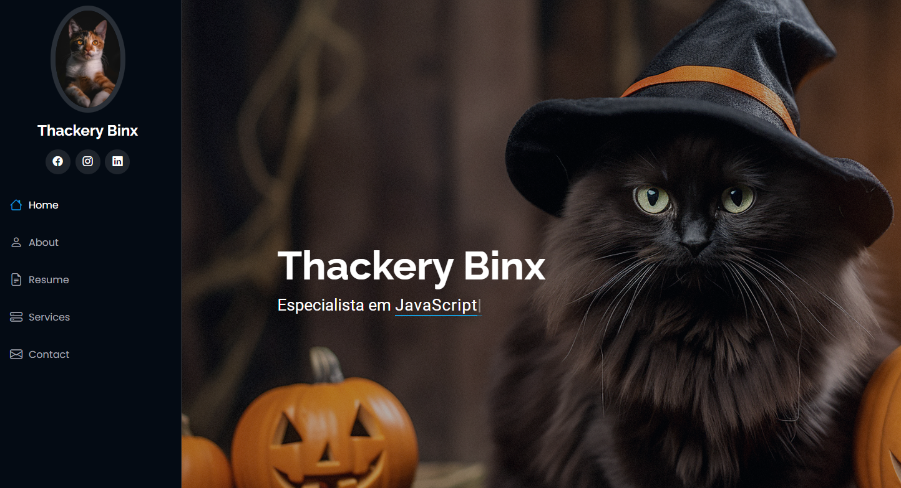

<h1 align="center"> primeiro-repositorio </h1> 

* Baseado no Template: [iPortfolio](https://bootstrapmade.com/iportfolio-bootstrap-portfolio-websites-template/)
* Autor: [BootstrapMade](BootstrapMade.com)
* Licença: [Bootstrap Made License](https://bootstrapmade.com/license/)

## Projeto Prático

Portfólio criado na faculdade durante as aulas de Bootstrap.

 

 

 

<h2> Suggestions </h2>

 Do you want to add or report an error? Please, feel free to do it! 😉 

 

<h2> Support </h2>

 If you liked it, press the Star ⭐ Button, please! 😄 

